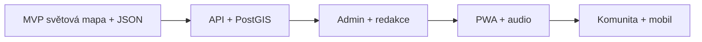

# Roadmapa MysteryMap.online

## Fáze 1: MVP

- Statický frontend s globální mapou, filtrováním, samostatnou stránkou místa a prototypem check-inu.
- JSON databáze podle schématu z `1.txt`.
- Redakční pipeline: vlastní texty, otevřené zdroje, citace u každého místa.
- První sada 100 světových míst ručně ověřených z více zdrojů.
- SEO stránky podle kontinentů, zemí a kategorií generované z dat.
- Statický `search-index.json` pro rychlé vyhledávání bez backendu.
- Později napojit API, autentizaci a uložiště odznaků.

## Fáze 2: Produkční web

- Backend: Node/TypeScript nebo Python, Postgres + PostGIS.
- REST API podle `docs/api.md`.
- Admin rozhraní pro redakci a kontrolu zdrojů.
- PWA: offline cache detailů, uložené výpravy, push notifikace, regionální balíčky.
- Audio průvodci a odemykaný obsah po check-inu.

## Fáze 3: Komunita a mobil

- Komunitní návrhy míst s moderací.
- Vlastní trasy podle kraje, času a obtížnosti.
- Nativní mobilní aplikace, pokud webová PWA přestane stačit.

